# Coffee Crew

[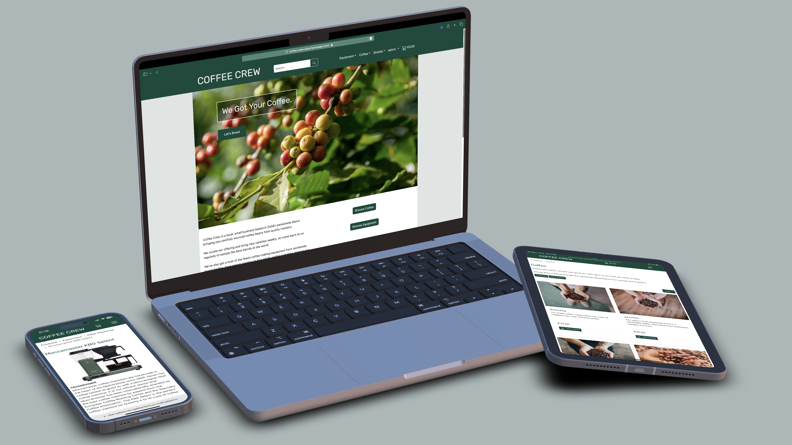](https://coffee-crew-shop.herokuapp.com/)
[Link to Live Site](https://coffee-crew-shop.herokuapp.com/)

## Table of Contents

<!-- TODO: Add Table of Content -->

## Introduction

The project is an E-commerce site for a shop selling specialty coffee and brewing equipment. 

Users including guests can browse products and add products to their cart.

Registered users can place orders, save products to a wishlist, save their details for future and see their past orders.

The project was built keeping the Agile management principles in mind, and I utilised many of GitHub's features such as Issue and Projects to implement scrum methodology despite working alone.

I wanted to build a front end for the business owner to manage the shop without entering the Django Admin panel.

[Kanban Board for project](https://github.com/users/davidindub/projects/8/)

[Closed Issues on GitHub for the project](https://github.com/davidindub/coffeecrew/issues?q=is%3Aissue+is%3Aclosed)

I used [GitHub issues](https://github.com/davidindub/coffeecrew/issues) for the product backlog containing the user stories. Issues were also used for bug reports so I could keep track of tricky bugs over time.

I used the tags feature in GitHub Issues for assigning story points, prioritising features based on [the MoSCoW method](https://en.wikipedia.org/wiki/MoSCoW_method), and categorising the user stories.

I used the [Milestones feature](https://github.com/davidindub/coffeecrew/milestones) to plan sprints and set deadlines.

## User Stories

User stories were prepared using GitHub Issues and assigned story points based on estimated completion time.

User Stories can been seen below under [User Story Testing](#user-story-testing), and in the [GitHub Issues](https://github.com/davidindub/coffeecrew/issues?q=is%3Aissue+is%3Aclosed) for full details including screenshots, story points and associated sprints.

## UX


I used a colour scheme I based on a [mockup by Tanim Khan](https://dribbble.com/shots/14147142-Plant-Shop-Landing-Page) on Dribble that I had previously used and like for a previous project - [Plant Cafe](https://github.com/davidindub/plant-cafe).


I used [Bootstrap Icons](https://icons.getbootstrap.com/) throughout the project for icons such as the cart, edit buttons etc.

I used CSS Variables to use my chosen colour palette and font across the project easily.


```css
:root {
    --main-bg-color: rgb(223, 228, 227);
    --color-primary: rgb(15, 74, 59);
    --color-primary-lighter: rgb(25, 114, 92);
    --color-secondary: rgb(255, 208, 138);
    --color-tertiary: rgb(218, 217, 205);
    --color-white: rgb(255, 255, 255);
    --color-black: rgb(0, 0, 0);
    --color-off-white: rgb(237, 237, 237);
    --font-display-font: 'Rubik', sans-serif;
    --bs-breadcrumb-divider: ">";
}
```

I used the latest version of Bootstrap (5.3), which includes support for CSS Variables.
I used this new recommended approach along with my own variables to customise bootstrap elements.

An example of this can be seen on one of the custom classes for button-like links:

```css
.btn-cc {
    --bs-btn-color: var(--color-off-white);
    --bs-btn-hover-color: var(--color-off-white);
    --bs-btn-bg: var(--color-primary);
    --bs-btn-hover-bg: var(--color-primary-lighter);
    --bs-btn-border-color: var(--color-primary);
    --bs-btn-active-border-color: var(--color-primary);
    --bs-btn-hover-border-color: var(--color-primary);
}
```

See: [Bootstrap Docs - Root Variables](https://getbootstrap.com/docs/5.3/customize/css-variables/#root-variables)

### Typography


I used the sans-serif font [Rubik](https://fonts.google.com/specimen/Rubik) from Google Fonts. I like its subtle rounded corners and it makes a nice readable display font for the logo and headings.

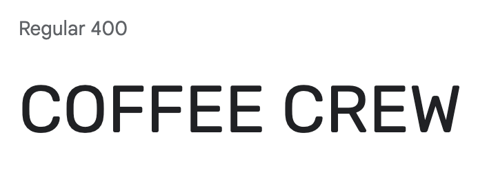

For the body text, I let Bootstrap style the font as it used a native font stack for different devices resulting in a nice native looking appearance.
See: [Bootstrap Docs - Native Font Stack](https://getbootstrap.com/docs/5.3/content/reboot/#native-font-stack)


### Wireframes

I drew some wireframes using [Balsamiq](https://balsamiq.com/) of the landing page and products page. I knew I had the elements available in Bootstrap to get this layout up and running fast.

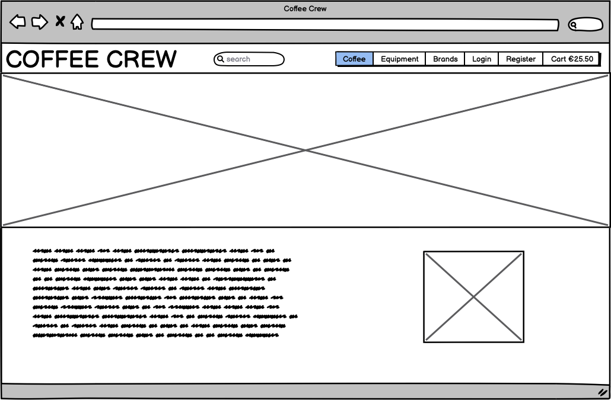

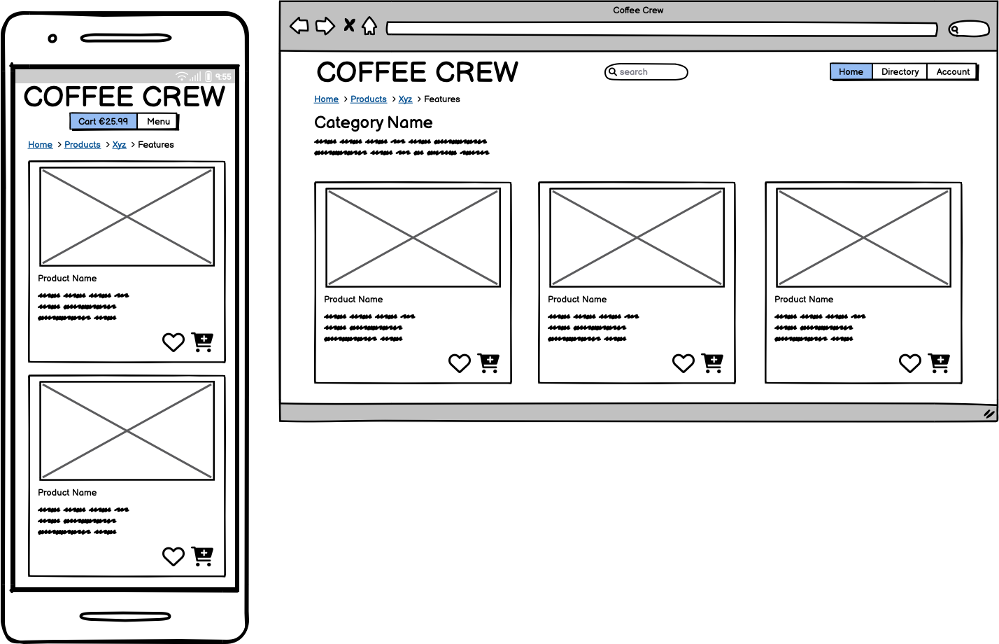

## Accessibility

I ensured that every element met AAA level in the [Web Content Accessibility Guidelines](https://www.w3.org/WAI/WCAG2AAA-Conformance) (WCAG).

<details>
<summary>WebAim contrast check</summary>
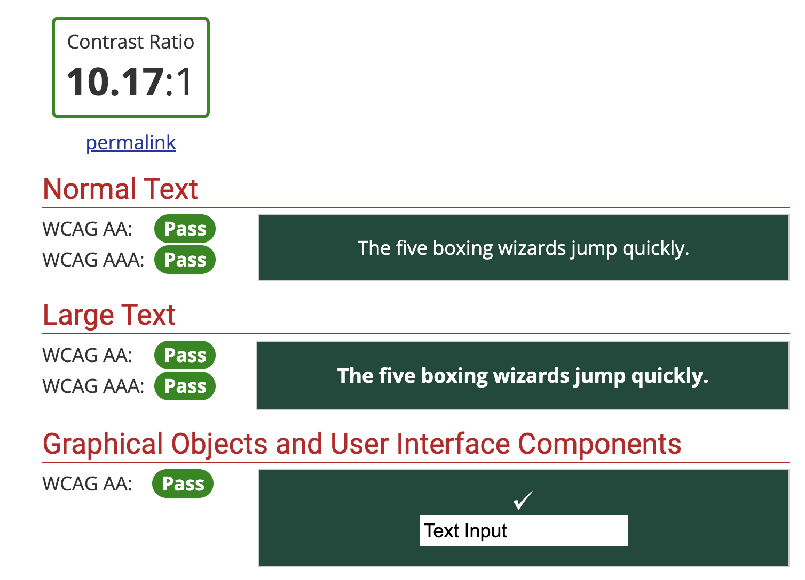
</details>

Buttons featuring icons have appropriate `aria-labels` where necessary, and notification messages have `aria-live` tags and are read by screen readers.

I tested navigating the project with VoiceOver on macOS.

I used inline SVGs for icons in the project.

I recently watched [Seren Davies](https://github.com/ninjanails)' talk [Death to Icon Fonts](https://www.youtube.com/watch?v=9xXBYcWgCHA) where I learned of the issues that icon fonts can cause for accessibility. I researched the best way to use inline SVG icons, including descriptions where appropriate for screen readers. By using SVGs the icons don't break if a user chooses to use a custom font such as [Dyslexie](https://www.dyslexiefont.com/).

SVGs that aren't purely decorative always include an `aria-label` for screenreaders, and I tested them using VoiceOver on macOS.

See also:

- [Inline SVG vs Icon Fonts - CSS Tricks](https://css-tricks.com/icon-fonts-vs-svg/)
- [SVG, Icon Fonts, and Accessibility: A Case Study - 24 Accessibility](https://www.24a11y.com/2017/svg-icon-fonts-accessibility-case-study/)

## Database Design

I used [Miro](https://miro.com/) to design the models. I created a Profile model to associate extra information with users not included in the default Django user model.


## Features

## Existing Features

### Landing Page

The landing page features and eye catching hero image and slogan, with a call to action to lead the user to see products for sale.

Underneath is a quick paragraph introducing the business and quick links to the Coffee and Equipment products.

Below that, the three newest products on the shop are highlighted.

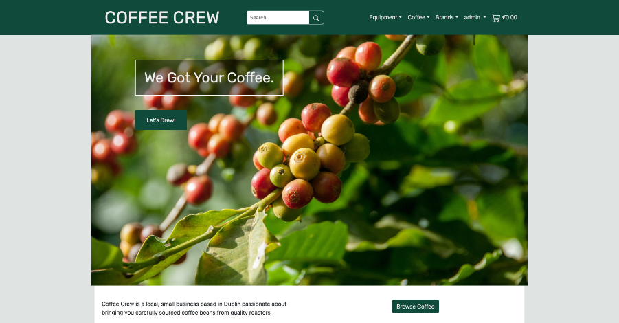

<details>
<summary>
Screenshot of the full landing page on desktop and mobile
</summary>

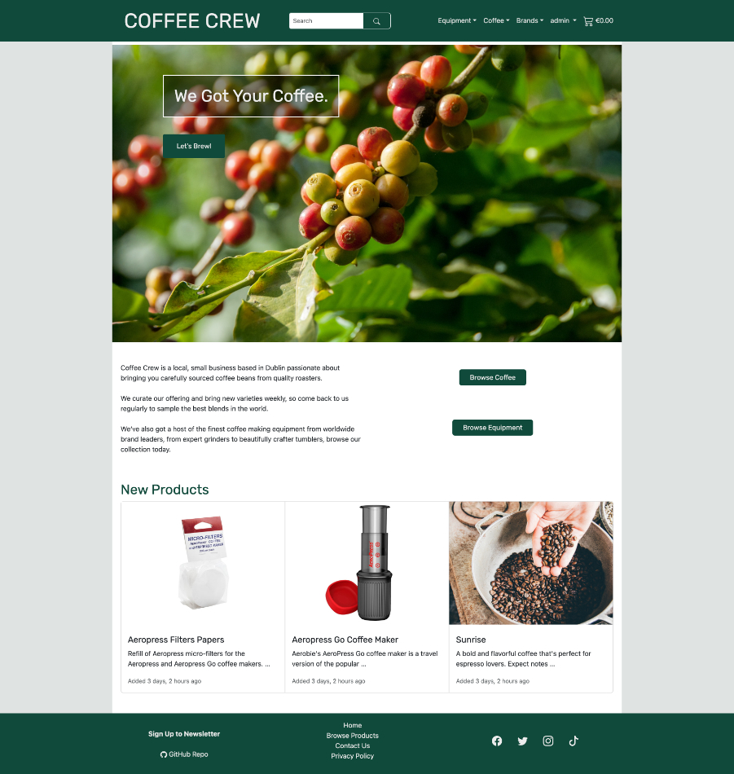

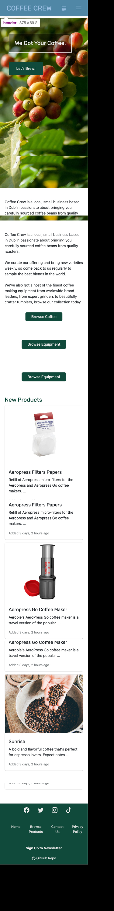

</details>

### Navbar

The Navbar contains dropdown menus to browse Coffee, Equipment, and Products by Brand.

Guests see links to Register or Login.

Logged in Users will see their username as a dropdown containing:
- My Account
- My Orders
- Wishlist, along with a badge containing the number of items in their wishlist.
- Log Out

<details>
<summary>
Screenshot of dropdown for users
</summary>

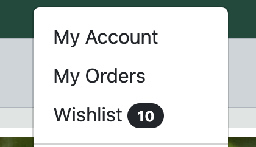

</details>

In addition to these, staff members have access to:
- Manage Shop
- Manage Products
- Manage Orders

<details>
<summary>
Screenshot of dropdown for staff members
</summary>

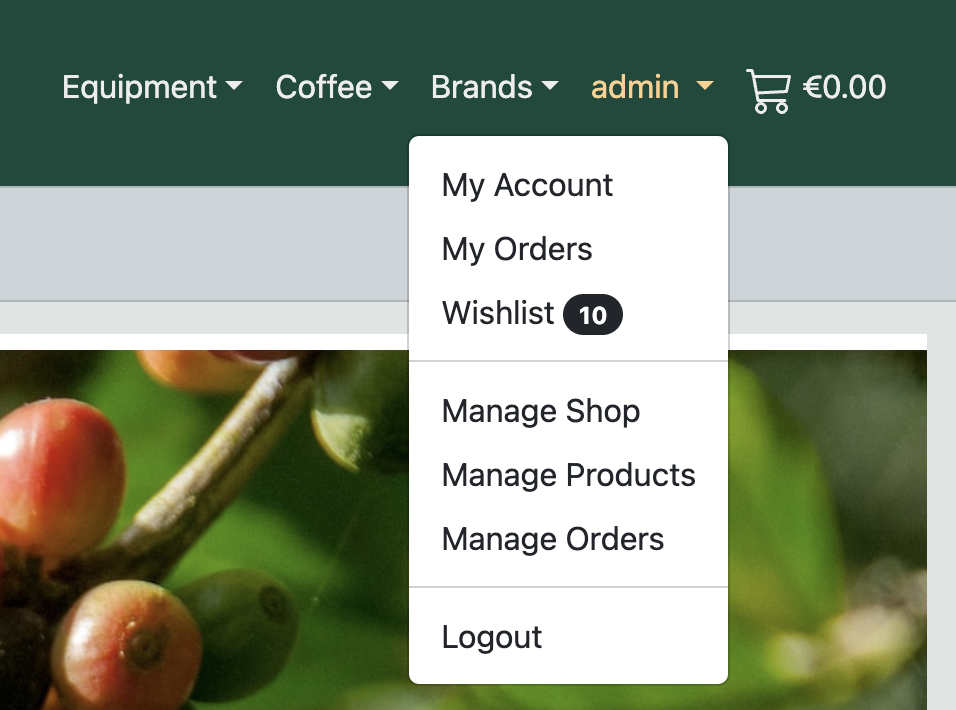

</details>


### Shopping Cart

Guests and registered users can add products to their shopping cart, and the total of their cart is displayed clearly in the navbar on medium sized screen sizes and up.

I implemented the cart for guest (non-signed in users) by linking their Session ID to a cart in the database.

See: [Django Docs - Sessions](https://docs.djangoproject.com/en/4.1/topics/http/sessions/)

I added a way for staff to purge old (not updated in over two weeks) carts from the Database in the Staff Frontend.

On the cart page, users can select if they would like their coffee beans ground.

<details>
<summary>
Screenshots of Shopping Cart on mobile and desktop
</summary>


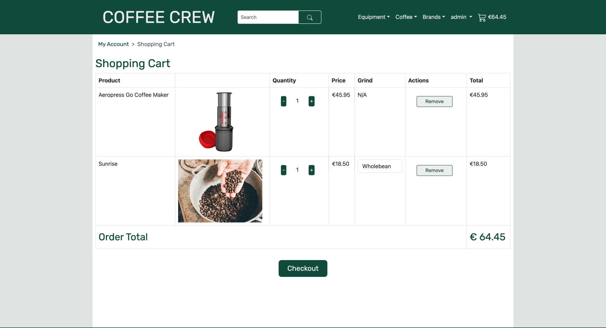

</details>

### Products List


If you're on the page of a Department, you'll see links to click to get to the subcategories of that department.

A blurb/description accompanies the department or category.

Sorting options are available to sort the list by:
- Newest First
- Name (A-Z)
- Name (Z-A)
- Price (Low to High)
- Price (High to Low)

If there are more than 8 products to display, the list is paginated to 8 per page and links to the different pages shown.

<details>
<summary>
Screenshots of Product Detail page
</summary>

Products List with Sort Options:

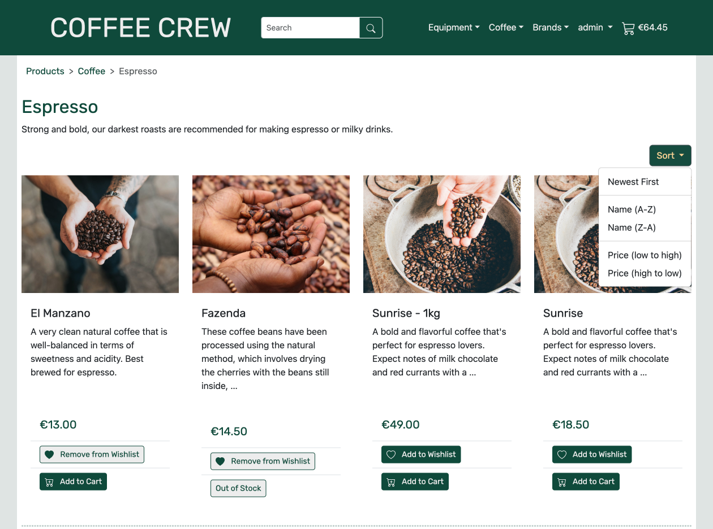


List Pagination:
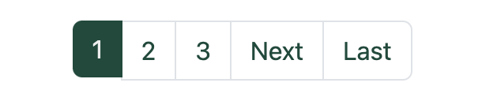

</details>


### Product Detail Page

Users can click the product's brand name to find more products from the same brand.

If the product is out of stock, the add to cart button is disabled and replaced with a message.

<details>
<summary>
Screenshots of Product Detail page
</summary>

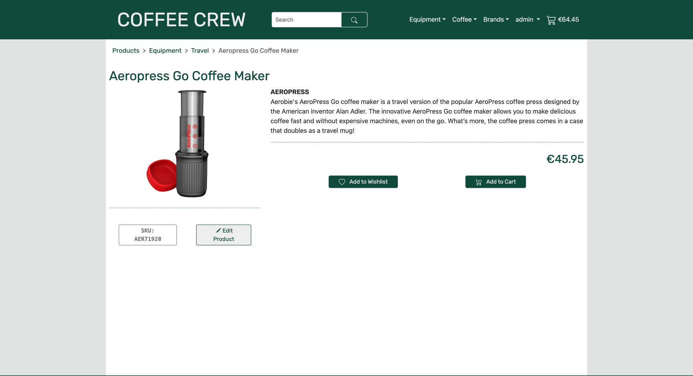

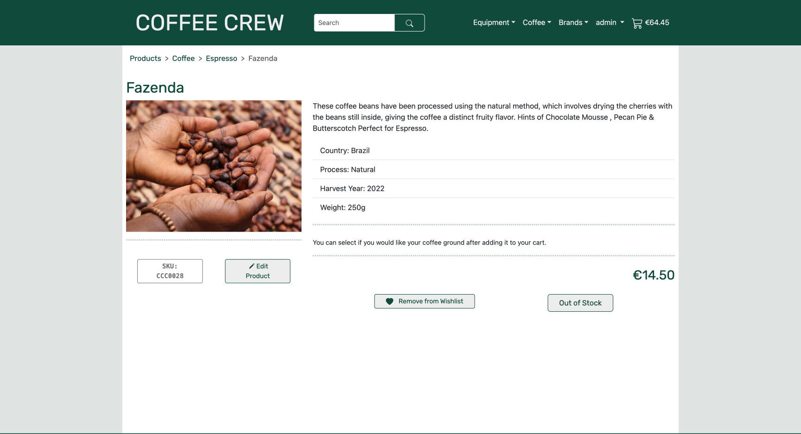

</details>

**For Staff Only:**

- Staff have access to the Product SKU and an Edit Product button.

### Register / Login

Users can either sign up using their Google or directly on the site.

Users signing up with Google don't need to create a password.

After signing up, users need to verify their account by clicking the link in the welcome email.

Handy links to popular Email services are included for quick access.

<details>
<summary>
Screenshot of Verification Email Sent page
</summary>
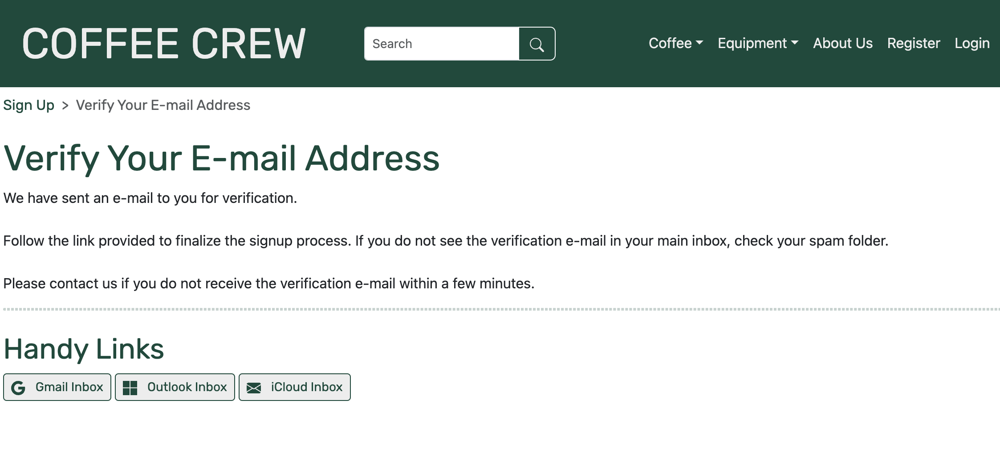
</details>

### Wishlist

Logged in users can save products to a wishlist for future reference.

### Checkout

There are four stages to the checkout process, the customer can easily see what stage of the process they are at with the progress bar at the top. I used combination of bootstrap elements to make this semantic progress bar.

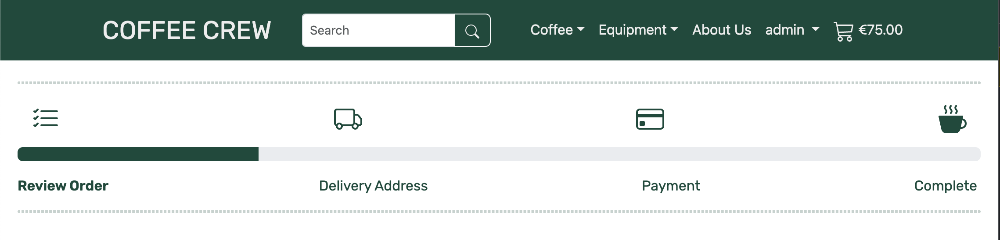

1. Review Order
2. Shipping Address
3. Billing Details
4. Order Confirmation

If the customer has a saved shipping address, they can populate the form with it by checking the box.

Delivery cost is shown when the user has filled out their address.

The Payment page clearly displays the total to be paid.

All information related to Billing is handled by Stripe.
If the user has a default billing address saved in their profile, it will be pre-populated in the Stripe form.

Billing Address or Card details are **never** saved in the database.


### Notification Emails

An email is sent to the customer when they make a new order.

I used Stripe's webhooks to only send the email when the payment is successfully completed.

<details>

<summary>Screenshot of an Order Confirmation Email</summary>

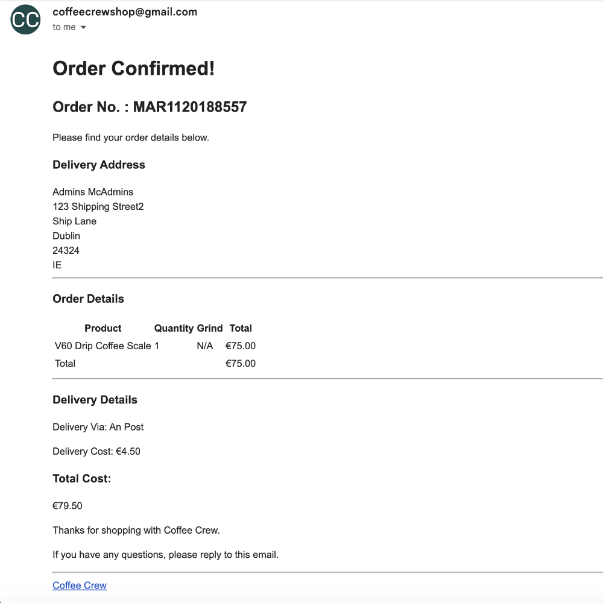

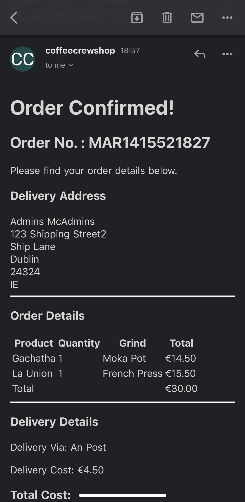

</details>


Another email is sent to the customer when their order is dispatched.

<details>

<summary>Screenshot of Customer Dispatch Email</summary>

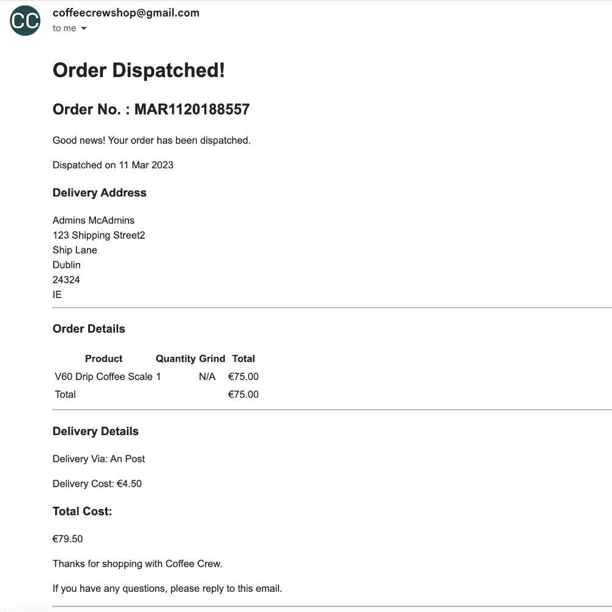

</details>

### Footer

The Footer includes:

- A link back to the homepage
- Links to the Contact Us page.
- A link to the Privacy Policy
- A link to the [GitHub repository for the project](https://github.com/davidindub/coffeecrew).

I rearranged the sections on mobile to get the layout I wanted.

<details>

<summary>Screenshot of Footer on mobile and desktop</summary>

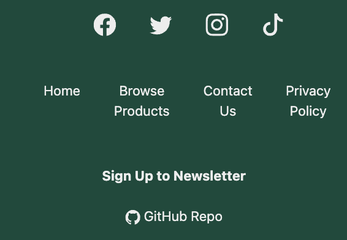


</details>

### Privacy Policy

As the project can collect data from users, I included a Privacy Policy link in the Footer which explains how data may be used. I used [GDPR.eu](https://gdpr.eu/) for help writing the policy.

The Privacy Policy is also clearly displayed to users on their first visit in the Cookie Consent popup.


See:
[Writing a GDPR-compliant privacy notice (template included)](https://gdpr.eu/privacy-notice/)

<details>
<summary>
Screenshot of Privacy Policy
</summary>
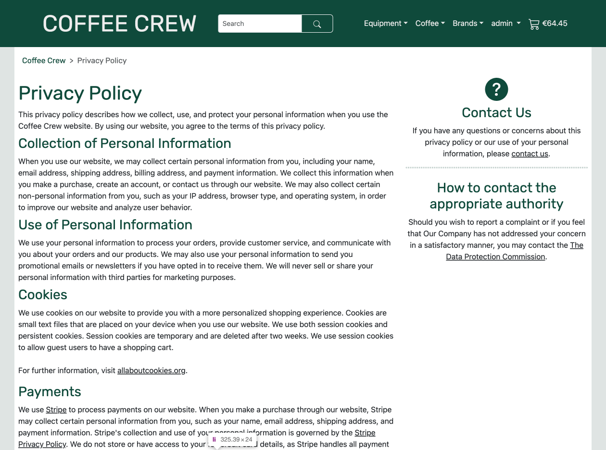

</details>

### Cookie Consent Banner

I implemented a cookie consent banner using handy code from [GDPR Compliant Cookie Consent Banner In JavaScript – GlowCookies](https://www.cssscript.com/gdpr-cookie-consent-banner/).

This code is well set up to later implement analytics such as Google Analytics or Meta Pixel.

<details>
<summary>
Screenshot of Cookie Consent banner
</summary>
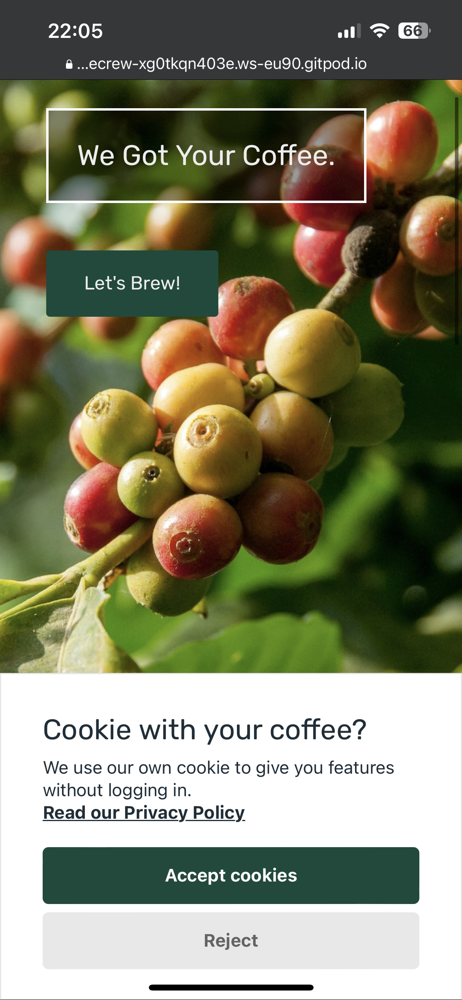

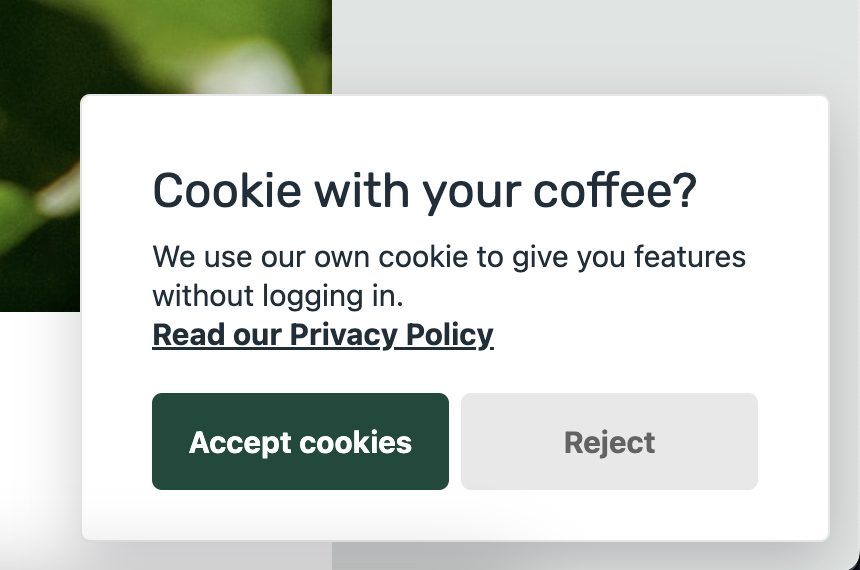

</details>


### Notifications

Django Messages and Bootstrap's Alerts elements were combined to make elegant dismissible notification messages when the user performs actions.

<details>
<summary>
Screenshot of Notification alert
</summary>
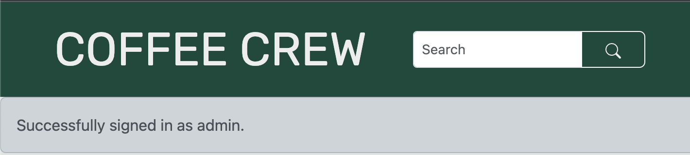
</details>

### Favicon


I included metadata for favicons and web app icons

I themed the browser window to match the site with the `theme-color <meta>` tag for browsers that support it such as Safari on macOS and Chrome on Android.


<details>
<summary>
Screenshot of Themed Browser Window
</summary>


</details>


## Staff Only Features

### Shop Management Dashboard

I wanted to create a front-end for a business owner to manage the store themselves without needing to code or enter the django-admin panel. I also protected fields in the django-admin panel that shouldn't be manually edited.

Lists of products in the staff dashboard feature lots of extra sorting options to help with managing the shop:
- Hidden First
- On Display First
- Stock (Low to High)
- Stock (High to Low)
- Sales (Low to High)
- Sales (High to Low)
- Oldest First
- Newest First
- Name (A-Z)
- Name (Z-A)
- Price (Low to High)
- Price (High to Low)


<details>
<summary>
Screenshot of Shop Management Dashboard
</summary>
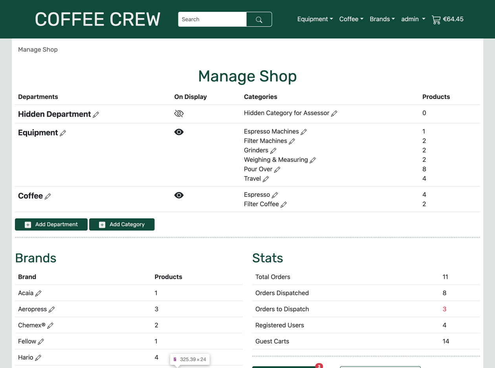

Sort options for product list in staff dashboard:
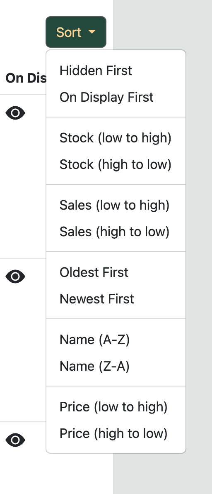
</details>


<details>
<summary>
More Screenshots of Shop Management
</summary>

Warning before deleting a Department that contains categories and products:
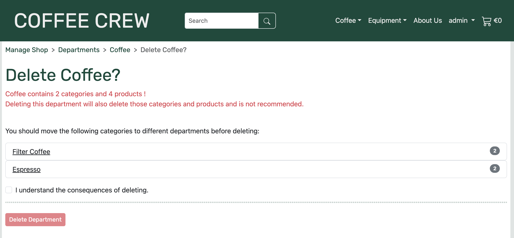

</details>


### Products Detail

As a staff member, each product page includes the product's SKU and an edit button. Extra fields are displayed for coffees such as harvest year, weight and processed used.

<details>
<summary>
Screenshot of editing a product as staff member
</summary>
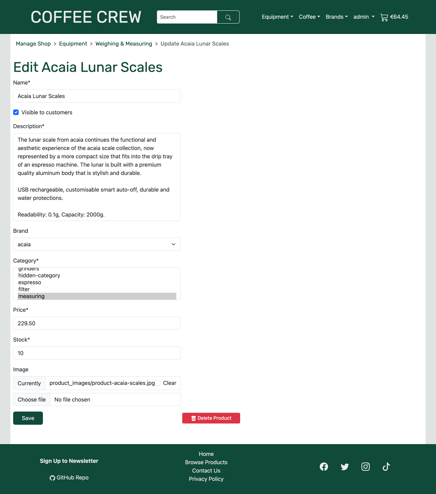
</details>


### Printable Order Sheets

I used media queries to create a print friendly layout for Orders so they can be printed out as packing slips by the business owner.

A Print Order button is included on the page for staff only.

<details>
<summary>
Screenshots of Printable Order Sheet Feature
</summary>

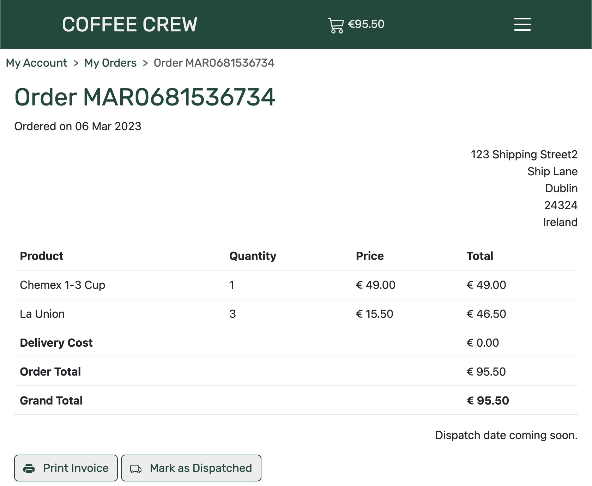

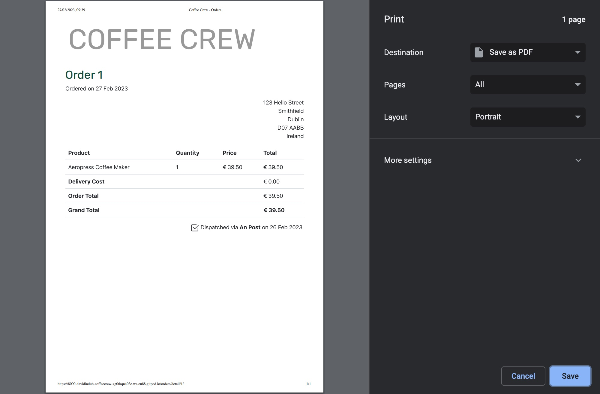

</details>

### Dispatch Orders

The Order page also includes a button for staff members to mark an order as dispatched.

<details>
<summary>Screenshot of Dispatching a Customer Order</summary>

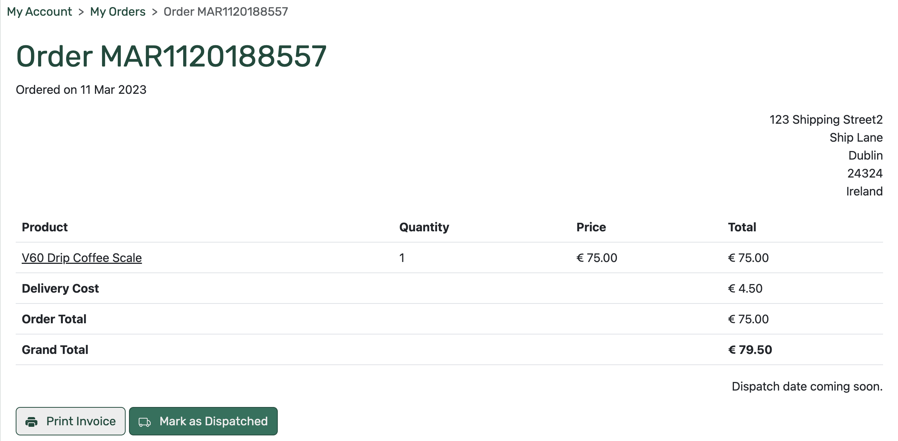

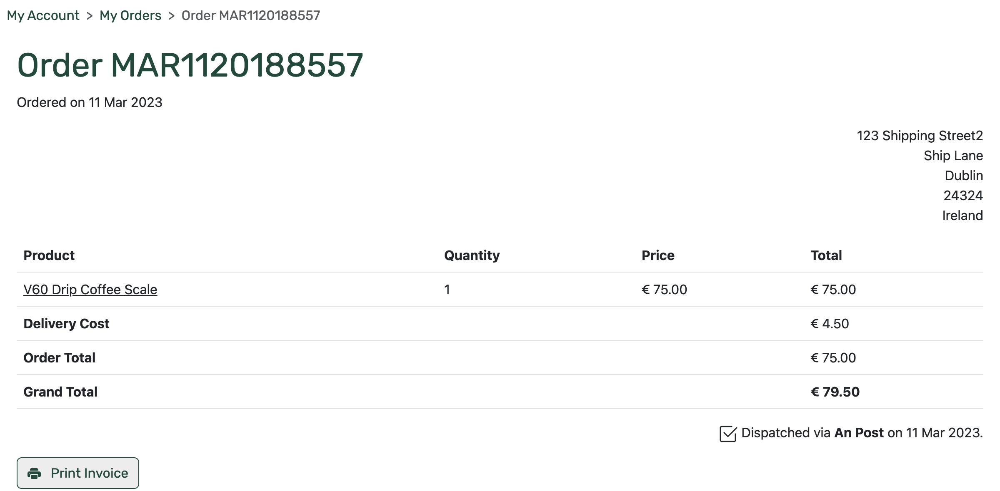


</details>


This updates the order in the database and sends the customer a dispatch notification email.


<details>
<summary>Screenshot of Customer Dispatch Email</summary>


</details>


### Custom Error Pages

Custom error pages were added for 403, 404, and 500 errors.

<details>
<summary>Screenshot of custom 404 page</summary>

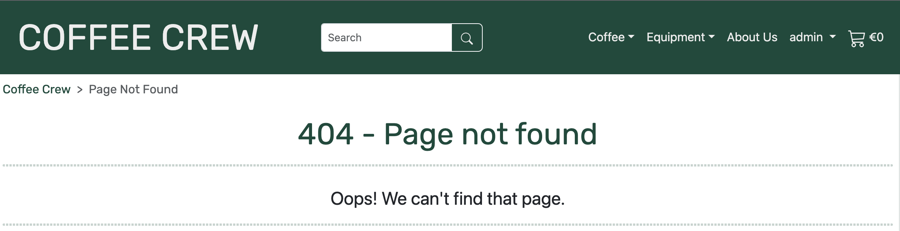

</details>


### Features Left to Implement

Features I didn't get to implement in this iteration but plan to add in future include:

- Guests should be able to place orders without registering for an account
- A Discount Code system or Option for time-based Sales
- I would like migrate to using Stripe Checkout as some of these features like discount codes come built-in.
- Control over Delivery Options and Costs through the staff dashboard. I didn't want these to be hard coded in but cut this feature due to time constraints.
- Mailchimp could be connected to user profiles to include campaigns such as birthday emails with discounts, or follow up emails on completed orders.
- A "recently viewed" carousel of products to follow the user around the site.
- Sign in with Google, I had trouble getting this working error-free despite using it on previous projects. I will reinstate it in future.
- Add a CAPTCHA or some other form of validation to Contact Us form to prevent abuse.

See also: [#wont-fix Issues on GitHub](https://github.com/davidindub/coffeecrew/issues?q=is%3Aissue+is%3Aclosed+label%3Awontfix)

## Technologies Used

- [Python](https://www.python.org/)
- [Django](https://www.djangoproject.com) used as the Python framework for the site.
- [pip](https://pip.pypa.io/en/stable/) for installing Python packages.
- [Git](https://git-scm.com/) for version control.
- [Sourcetree](https://www.sourcetreeapp.com/) for managing the remote repository.
- [AWS S3](https://aws.amazon.com/s3) used for online static file storage.
- [PostgreSQL](https://www.postgresql.org) used as the relational database management.
- [ElephantSQL](https://www.elephantsql.com) used as the Postgres database.
- [Heroku](https://www.heroku.com) used for hosting the deployed back-end site.
- [GitHub](https://github.com/) for storing the repository online during development.
- GitHub Projects was invaluable throughout the project and helped me keep track of things to do and bugs to fix - you can see [the project's board here](https://github.com/users/davidindub/projects/8).
- [GitPod](https://gitpod.io/) as a cloud based IDE.
- [Balsamiq](https://balsamiq.com/wireframes/) for wireframing.
- [Bootstrap 5](https://getbootstrap.com/) as a front end framework.
- [Google Chrome](https://www.google.com/intl/en_ie/chrome/), [Mozilla Firefox](https://www.mozilla.org/en-US/firefox/new/) and [Safari](https://www.apple.com/safari/) for testing on macOS Monterey.
- [Microsoft Edge](https://www.microsoft.com/en-us/edge) for testing on Windows 11.
- [Safari](https://www.apple.com/safari/) on iOS and iPadOS 15.
- [Google Chrome](https://www.google.com/intl/en_ie/chrome/) on Android 12.
- [Miro](https://www.miro.com/) for drawing database diagrams.
- [Mailchimp](https://mailchimp.com/) for newsletter subscription service.
- [Copy.ai](https://www.copy.ai/) for inspiration for some of the slogans and headlines.
- [favicon.io](https://favicon.io/favicon-generator/) to make a favicon for site.
- [Device Frames](https://deviceframes.com/) for the device mockups in this README.
- [Meta Tags](https://metatags.io/) to prepare the Meta tags for social media share previews.
- [Markdown Builder by Tim Nelson](https://traveltimn.github.io/markdown-builder) used to help generate documentation.

## External Python Packages Used


## Ecommerce Business Model

This site sells goods to individual customers, and therefore follows a `Business to Customer` model.
It is of the simplest **B2C** forms, as it focuses on individual transactions, and doesn't need anything
such as monthly/annual subscriptions.

It is still in its early development stages, although it already has a newsletter, and links for social media marketing.

Social media can potentially build a community of users around the business, and boost site visitor numbers,
especially when using larger platforms such a Facebook.

A newsletter list can be used to send regular messages to site users who opt in, such as what items are on special offer, new items in stock. See [Newsletter Marketing](#newsletter-marketing) below.

## Search Engine Optimization (SEO) & Social Media Marketing

### Keywords

I've identified some appropriate keywords to align with my site, that should help users
when searching online to find my page easily from a search engine.
I made sure to make use of semantic html so these keywords were picked up by search engines.

```html
<meta name="title" content="Coffee Crew">
<meta name="description" content="Dublin based specialty coffee roasters. Fresh coffee and premium brewing kit, fast shipping anywhere in Europe.">
```

### Metadata

I included Metadata to ensure thumbnails and information is presented correctly when shared on Facebook, Twitter and other Social Media.

<details>
<summary>
Screenshot of social cards preview
</summary>

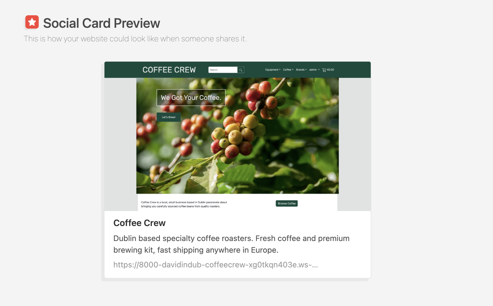

</details>

### Sitemap

I've used [XML-Sitemaps](https://www.xml-sitemaps.com) to generate a sitemap.xml file.
This was generated using my deployed site URL: https://coffee-crew-shop.herokuapp.com

After it finished crawling the entire site, it created a
[sitemap.xml](sitemap.xml) which I've downloaded and included in the repository.

### Robots

I've created the [robots.txt](robots.txt) file at the root-level.
Inside, I've included the settings:

```
User-agent: *
Disallow: /staff/
Disallow: /checkout/
Sitemap: https://coffee-crew-shop.herokuapp.com/sitemap.xml
```

Further links for future implementation:
- [Google search console](https://search.google.com/search-console)
- [Creating and submitting a sitemap](https://developers.google.com/search/docs/advanced/sitemaps/build-sitemap)
- [Managing your sitemaps and using sitemaps reports](https://support.google.com/webmasters/answer/7451001)
- [Testing the robots.txt file](https://support.google.com/webmasters/answer/6062598)

### Social Media Marketing

Creating a strong social base (with participation) and linking that to the business site can help drive sales.

I included links in the footer which could be used for potential Facebook, Twitter, Instagram and TikTok presences for the business.

I've created a mockup Facebook business account using the
[Balsamiq template](https://code-institute-org.github.io/5P-Assessments-Handbook/files/Facebook_Mockups.zip)
provided by Code Institute.

<details>
<summary>Facebook Page Mockup</summary>
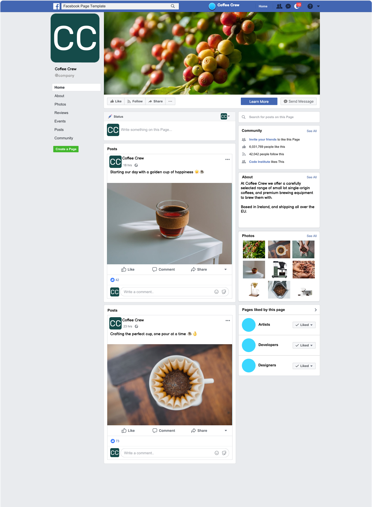
</details>

For this business I envision a lot of the social media marketing being very visual, using the current most popular formats like Instagram Reels and TikTok. As these are primarily video based I did not mock any for the purposes of this coding project.
However, I used royalty free photos in the project from Unsplash which I felt fit the vibe I would portray on social media, using soft focused earthy tone photos.

### Newsletter Marketing

I used [Mailchimp](https://mailchimp.com/) to set up a newsletter sign-up form on my application, to allow users to supply their
email address if they are interested in learning more and to drive repeat business. As the small lot coffees regularly change, I felt a newsletter for coffee enthusiasts keeping them up to date would work well.

I created a template of a potential welcome email and mapped out a potential customer journey in Mailchimp.
There's a lot of power in Mailchimp, and campaigns could be set up such as a discount code near a customer's birthday, or integration with webhooks.

<details>
<summary>
Screenshots of Mailchimp Campaign
</summary>

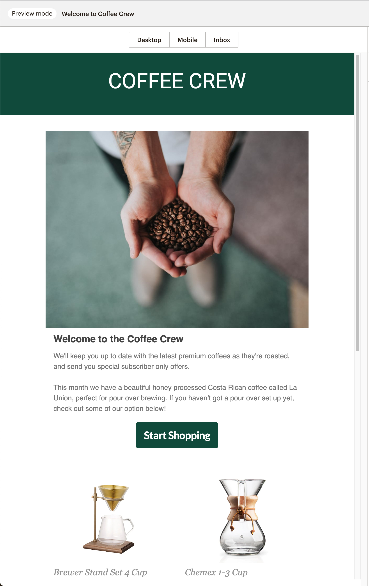

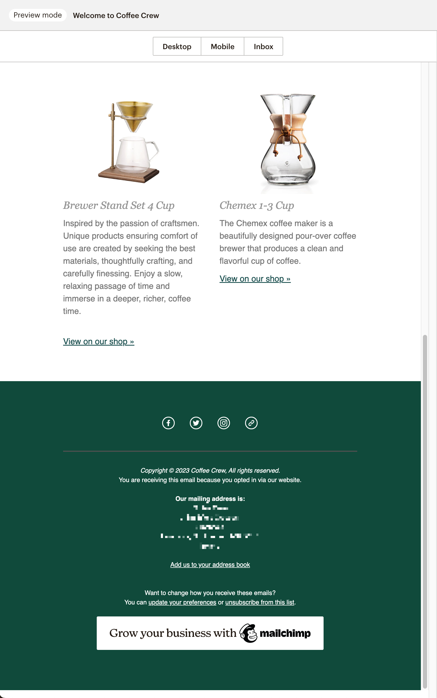

</details>


## Testing

I performed extensive manual testing continuously as the project was being developed, and filed [bug reports on GitHub](https://github.com/davidindub/designland/issues?q=is%3Aissue+is%3Aclosed+label%3Abug) as issues were discovered to keep track of bugs. I kept track of how to recreate bugs, expected behaviour, screenshots of the issue and how it was resolved to help myself in future.

### Browser Compatibility

### Responsiveness

### Performance Testing

### Accessibility Testing

### User Story Testing

### Challenges Faced

- I ended up revising the models more times than I expected during development, despite spending time planning them out in advance. As I built more interoperability between the different Django apps I found more properties and methods that I hadn't initially thought of.

### Code Validation

#### HTML Validation

Pages were validating using the [W3 HTML Validator](https://validator.w3.org/nu/), and pages with content that varies based on guest/logged in user/admin status were validated in each state.

<details>
<summary>W3 HTML Validation</summary>

Live links to the validator provided for pages as guests, pages requiring authentication checked by pasting rendered HTML from a logged in user into validator.

| Page                | URL                | Logged In Status | Result                |
|---------------------|--------------------|------------------|-----------------------|
| Landing Page        | /                  | Guest            | [✅ No errors or warnings](https://validator.w3.org/nu/?doc=https://coffee-crew-shop.herokuapp.com/) |
| Landing Page        | /                  | User            | ✅ No errors or warnings |
| Shopping Cart        | /cart                  | Guest            | [✅ No errors or warnings](https://validator.w3.org/nu/?doc=https://coffee-crew-shop.herokuapp.com/cart/) |
| Shopping Cart        | /cart                  | User w/cart items            | ❗️ 1 warning due to using different colspans for mobile/desktop, rendered page passes |
| Department Page        | /shop/d/Equipment/                 | Guest            | [✅ No errors or warnings](https://validator.w3.org/nu/?doc=https://coffee-crew-shop.herokuapp.com/shop/d/Equipment/) |
| Products by Department Page        | /shop/d/Equipment/                  | User            | ✅ No errors or warnings |
| Products by Category Page        | /shop/c/travel                  | Guest            | [✅ No errors or warnings](https://validator.w3.org/nu/?doc=https://coffee-crew-shop.herokuapp.com/shop/c/travel/) |
| Products by Brand Page        | /shop/b/kinto                  | Guest            | [✅ No errors or warnings](https://validator.w3.org/nu/?doc=https://coffee-crew-shop.herokuapp.com/shop/b/kinto/) |
| Sign Up Page        | /accounts/signup/                  | Guest            | [✅ No errors or warnings](https://validator.w3.org/nu/?doc=https://coffee-crew-shop.herokuapp.com/accounts/signup/) |
| Login Page        | /accounts/login                  | Guest            | [✅ No errors or warnings](https://validator.w3.org/nu/?doc=https://coffee-crew-shop.herokuapp.com/accounts/login/) |
| Log Out Page        | /accounts/logout                  | User            | [✅ No errors or warnings](https://validator.w3.org/nu/?doc=https://coffee-crew-shop.herokuapp.com/accounts/logout/) |
| All Products List        | /                  | Guest            | [✅ No errors or warnings](https://validator.w3.org/nu/?doc=https://coffee-crew-shop.herokuapp.com/shop/) |
| Product Page, sorted        | /shop/?sort=date_added                  | Guest            | [✅ No errors or warnings](https://validator.w3.org/nu/?doc=https://coffee-crew-shop.herokuapp.com/shop/?sort=date_added) |
| Product Detail Page        | /item/sunrise                  | Guest            | [✅ No errors or warnings](https://validator.w3.org/nu/?doc=https://coffee-crew-shop.herokuapp.com/shop/item/sunrise) |
| My Account Page        | /account                  | Staff            | ✅ No errors or warnings |
| My Orders Page        | /account/orders/                  | User            | ✅ No errors or warnings |
| My Wishlist Page        | /wishlist                  | Staff            | [✅ No errors or warnings](https://validator.w3.org/nu/?doc=https%3A%2F%2Fcoffee-crew-shop.herokuapp.com%2Fnewsletter) |
| Manage Shop Page        | /staff                  | Staff            | ✅ No errors or warnings |
| Manage Products Page        | /staff/products                  | Staff            | ✅ No errors or warnings |
| Manage Orders Page        | /staff/orders                  | Staff            | ✅ No errors or warnings |
| Privacy Policy Page        | /privacy                  | Guest            | [✅ No errors or warnings](https://validator.w3.org/nu/?showsource=yes&doc=https%3A%2F%2Fcoffee-crew-shop.herokuapp.com%2Fprivacy#l324c6) |

</details>

#### CSS Validation

The custom CSS was validated using the [W3C CSS Validation Service](https://jigsaw.w3.org/css-validator/) as CSS level 3 + SVG. 


File | Result |
-----|--------|
`base.css` | [✅ Pass](docs/images/validation/css-validation/base-css.jpg) |
`checkout.css` | [✅ Pass](docs/images/validation/css-validation/checkout-css.jpg) |
`glowCookies.css` | [✅ Pass](docs/images/validation/css-validation/glowCookies-css.jpg) |


#### Python Validation

All the custom Python files pass PEP8 Validation, which I checked both in the development environment and on [CI Python Linter](https://pep8ci.herokuapp.com/).

`# noqa` was used in `settings.py` where line breaks in strings would have broken Django functionality.

| App                | File | Result |
|-------------|------------------|--------|
|         | `settings.py`            | [✅ Pass](docs/images/validation/python-linter-results/coffeecrew-settings-py.jpg) |
|         | `custom_storages.py`            | [✅ Pass](docs/images/validation/python-linter-results/custom-storages-py.jpg) |
| Cart        | `adapters.py`            | [✅ Pass](docs/images/validation/python-linter-results/cart-adapters-py.jpg) |
| Cart        | `context-processor.py`            | [✅ Pass](docs/images/validation/python-linter-results/cart-context-processor-py.jpg) |
| cart        | `forms.py`            | [✅ Pass](docs/images/validation/python-linter-results/cart-forms-py.jpg) |
| cart        | `models.py`            | [✅ Pass](docs/images/validation/python-linter-results/cart-models-py.jpg) |
| cart        | `set_cookie.py`            | [✅ Pass](docs/images/validation/python-linter-results/cart-set-cookie-py.jpg) |
| cart        | `urls.py`            | [✅ Pass](docs/images/validation/python-linter-results/cart-urls-py.jpg) |
| cart        | `views.py`            | [✅ Pass](docs/images/validation/python-linter-results/cart-views-py.jpg) |
| checkout        | `admin.py`            | [✅ Pass](docs/images/validation/python-linter-results/checkout-admin-py.jpg) |
| checkout        | `emails.py`            | [✅ Pass](docs/images/validation/python-linter-results/checkout-emails-py.jpg) |
| checkout        | `forms.py`            | [✅ Pass](docs/images/validation/python-linter-results/checkout-forms-py.jpg) |
| checkout        | `models.py`            | [✅ Pass](docs/images/validation/python-linter-results/checkout-models-py.jpg) |
| checkout        | `orders_urls.py`            | [✅ Pass](docs/images/validation/python-linter-results/checkout-orders-urls-py.jpg) |
| checkout        | `urls.py`            | [✅ Pass](docs/images/validation/python-linter-results/checkout-urls-py.jpg) |
| checkout        | `views.py`            | [✅ Pass](docs/images/validation/python-linter-results/checkout-views-py.jpg) |
| coffeecrew        | `urls.py`            | [✅ Pass](docs/images/validation/python-linter-results/coffeecrew-urls-py.jpg) |
| coffeecrew        | `StaffMemberRequiredMixin.py`            | [✅ Pass](docs/images/validation/python-linter-results/coffeecrew-StaffMemberRequiredMixin-py.jpg) |
| home        | `forms.py`            | [✅ Pass](docs/images/validation/python-linter-results/home-forms-py.jpg) |
| home        | `views.py`            | [✅ Pass](docs/images/validation/python-linter-results/home-views-py.jpg) |
| products        | `admin.py`            | [✅ Pass](docs/images/validation/python-linter-results/products-admin-py.jpg) |
| products        | `context_processors.py`            | [✅ Pass](docs/images/validation/python-linter-results/products-context-processors-py.jpg) |
| products        | `admin.py`            | [✅ Pass](docs/images/validation/python-linter-results/products-admin-py.jpg) |
| products        | `views.py`            | [✅ Pass](docs/images/validation/python-linter-results/products-views-py.jpg) |
| products        | `models.py`            | [✅ Pass](docs/images/validation/python-linter-results/products-models.py.jpg) |
| products        | `signals.py`            | [✅ Pass](docs/images/validation/python-linter-results/products-signals-py.jpg) |
| products        | `urls.py`            | [✅ Pass](docs/images/validation/python-linter-results/products-urls-py.jpg) |
| profiles        | `admin.py`            | [✅ Pass](docs/images/validation/python-linter-results/profiles-admin-py.jpg) |
| profiles        | `context_processors.py`            | [✅ Pass](docs/images/validation/python-linter-results/profiles-context-processors-py.jpg) |
| profiles        | `forms.py`            | [✅ Pass](docs/images/validation/python-linter-results/profiles-forms-py.jpg) |
| profiles        | `models.py`            | [✅ Pass](docs/images/validation/python-linter-results/profiles-models-py.jpg) |
| profiles        | `urls.py`            | [✅ Pass](docs/images/validation/python-linter-results/profiles-urls-py.jpg) |
| profiles        | `urls_wish_list.py`            | [✅ Pass](docs/images/validation/python-linter-results/profiles-urls-wish-list-py.jpg) |
| profiles        | `views.py`            | [✅ Pass](docs/images/validation/python-linter-results/profiles-views-py.jpg) |
| staff        | `forms.py`            | [✅ Pass](docs/images/validation/python-linter-results/staff-forms-py.jpg) |
| staff        | `urls.py`            | [✅ Pass](docs/images/validation/python-linter-results/staff-urls-py.jpg) |
| staff        | `views.py`            | [✅ Pass](docs/images/validation/python-linter-results/staff-views-py.jpg) |


#### JavaScript

File | Result |
-----|--------|
`checkout_delivery.js` | [✅ Pass](docs/images/validation/js-hint-results/checkout-delivery-js.jpg) |
`confirm_delete.js` | [✅ Pass](docs/images/validation/js-hint-results/confirm-delete-js.jpg) |
`glowCookies.js` | [⚠️ Warnings (library)](docs/images/validation/js-hint-results/glowCookies-js.jpg) |
`print_btn.js` | [✅ Pass](docs/images/validation/js-hint-results/print-btn-js.jpg) |
`stripe_elements.js` | [✅ Pass](docs/images/validation/js-hint-results/stripe-elements-js.jpg) |

---

## Deployment

The live deployed application can be found deployed on [Heroku](https://coffee-crew-shop.herokuapp.com).

### ElephantSQL Database

This project uses [ElephantSQL](https://www.elephantsql.com) for the PostgreSQL Database.

To obtain your own Postgres Database, sign-up with your GitHub account, then follow these steps:

- Click **Create New Instance** to start a new database.
- Provide a name (this is commonly the name of the project: coffeecrew).
- Select the **Tiny Turtle (Free)** plan.
- You can leave the **Tags** blank.
- Select the **Region** and **Data Center** closest to you.
- Once created, click on the new database name, where you can view the database URL and Password.

### Amazon AWS

This project uses [AWS](https://aws.amazon.com) to store media and static files online, due to the fact that Heroku doesn't persist this type of data.

Once you've created an AWS account and logged-in, follow these series of steps to get your project connected.
Make sure you're on the **AWS Management Console** page.

<details>
<summary>Full details of setting up AWS for deployment</summary>

#### S3 Bucket

- Search for **S3**.
- Create a new bucket, give it a name (matching your Heroku app name), and choose the region closest to you.
- Uncheck **Block all public access**, and acknowledge that the bucket will be public (required for it to work on Heroku).
- From **Object Ownership**, make sure to have **ACLs enabled**, and **Bucket owner preferred** selected.
- From the **Properties** tab, turn on static website hosting, and type `index.html` and `error.html` in their respective fields, then click **Save**.
- From the **Permissions** tab, paste in the following CORS configuration:

	```shell
	[
		{
			"AllowedHeaders": [
				"Authorization"
			],
			"AllowedMethods": [
				"GET"
			],
			"AllowedOrigins": [
				"*"
			],
			"ExposeHeaders": []
		}
	]
	```

- Copy your **ARN** string.
- From the **Bucket Policy** tab, select the **Policy Generator** link, and use the following steps:
	- Policy Type: **S3 Bucket Policy**
	- Effect: **Allow**
	- Principal: `*`
	- Actions: **GetObject**
	- Amazon Resource Name (ARN): **paste-your-ARN-here**
	- Click **Add Statement**
	- Click **Generate Policy**
	- Copy the entire Policy, and paste it into the **Bucket Policy Editor**

		```shell
		{
			"Id": "Policy1234567890",
			"Version": "2012-10-17",
			"Statement": [
				{
					"Sid": "Stmt1234567890",
					"Action": [
						"s3:GetObject"
					],
					"Effect": "Allow",
					"Resource": "arn:aws:s3:::your-bucket-name/*"
					"Principal": "*",
				}
			]
		}
		```

	- Before you click "Save", add `/*` to the end of the Resource key in the Bucket Policy Editor (like above).
	- Click **Save**.
- From the **Access Control List (ACL)** section, click "Edit" and enable **List** for **Everyone (public access)**, and accept the warning box.
	- If the edit button is disabled, you need to change the **Object Ownership** section above to **ACLs enabled** (mentioned above).

#### IAM

Back on the AWS Services Menu, search for and open **IAM** (Identity and Access Management).
Once on the IAM page, follow these steps:

- From **User Groups**, click **Create New Group**.
	- Suggested Name: `group-coffeecrew` (group + the project name)
- Tags are optional, but you must click it to get to the **review policy** page.
- From **User Groups**, select your newly created group, and go to the **Permissions** tab.
- Open the **Add Permissions** dropdown, and click **Attach Policies**.
- Select the policy, then click **Add Permissions** at the bottom when finished.
- From the **JSON** tab, select the **Import Managed Policy** link.
	- Search for **S3**, select the `AmazonS3FullAccess` policy, and then **Import**.
	- You'll need your ARN from the S3 Bucket copied again, which is pasted into "Resources" key on the Policy.

		```shell
		{
			"Version": "2012-10-17",
			"Statement": [
				{
					"Effect": "Allow",
					"Action": "s3:*",
					"Resource": [
						"arn:aws:s3:::your-bucket-name",
						"arn:aws:s3:::your-bucket-name/*"
					]
				}
			]
		}
		```
	
	- Click **Review Policy**.
	- Suggested Name: `policy-coffeecrew` (policy + the project name)
	- Provide a description:
		- "Access to S3 Bucket for coffeecrew static files."
	- Click **Create Policy**.
- From **User Groups**, click your "group-coffeecrew".
- Click **Attach Policy**.
- Search for the policy you've just created ("policy-coffeecrew") and select it, then **Attach Policy**.
- From **User Groups**, click **Add User**.
	- Suggested Name: `user-coffeecrew` (user + the project name)
- For "Select AWS Access Type", select **Programmatic Access**.
- Select the group to add your new user to: `group-coffeecrew`
- Tags are optional, but you must click it to get to the **review user** page.
- Click **Create User** once done.
- You should see a button to **Download .csv**, so click it to save a copy on your system.
	- **IMPORTANT**: once you pass this page, you cannot come back to download it again, so do it immediately!
	- This contains the user's **Access key ID** and **Secret access key**.
	- `AWS_ACCESS_KEY_ID` = **Access key ID**
	- `AWS_SECRET_ACCESS_KEY` = **Secret access key**

#### Final AWS Setup

- If Heroku Config Vars has `DISABLE_COLLECTSTATIC` still, this can be removed now, so that AWS will handle the static files.
- Back within **S3**, create a new folder called: `media`.
- Select any existing media images for your project to prepare them for being uploaded into the new folder.
- Under**Manage Public Permissions**, select**Grant public read access to this object(s)**.
- No further settings are required, so click**Upload**.

</details>

### Heroku Deployment

This project uses [Heroku](https://www.heroku.com), a platform as a service (PaaS) that enables developers to build, run, and operate applications entirely in the cloud.

Deployment steps are as follows, after account setup:

- Select**New** in the top-right corner of your Heroku Dashboard, and select**Create new app** from the dropdown menu.
- Your app name must be unique, and then choose a region closest to you (EU or USA), and finally, select**Create App**.
- From the new app**Settings**, click**Reveal Config Vars**, and set your environment variables.

| Key | Value |
| --- | --- |
| `AWS_ACCESS_KEY_ID` | insert your own AWS Access Key ID key here |
| `AWS_SECRET_ACCESS_KEY` | insert your own AWS Secret Access key here |
| `AWS_S3_REGION_NAME` | region name of the AWS region used (e.g 'eu-central-2')
| `AWS_STORAGE_BUCKET_NAME` | name of the bucket in AWS
| `DATABASE_URL` | insert your own ElephantSQL database URL here |
| `DISABLE_COLLECTSTATIC` | 1 (*this is temporary, and can be removed for the final deployment*) |
| `SECRET_KEY` | insert your Django secret key
| `EMAIL_HOST_PASS` | insert your own Gmail API key here |
| `EMAIL_HOST_USER` | insert your own Gmail email address here |
| `SECRET_KEY` | this can be any random secret key |
| `STRIPE_PUBLIC_KEY` | insert your own Stripe Public API key here |
| `STRIPE_SECRET_KEY` | insert your own Stripe Secret API key here |
| `STRIPE_WH_SECRET` | insert your own Stripe Webhook API key here |
| `EMAIL_HOST_USER` | insert your email address for sending emails (I used a Gmail account)
| `EMAIL_HOST_PASS` | insert your app password for the email address
| `USE_AWS` | True |
| `HEROKU_HOSTNAME` | insert url of deployed project on Heroku

Heroku needs two additional files in order to deploy properly.
- requirements.txt
- Procfile

You can install this project's **requirements** (where applicable) using:
- `pip3 install -r requirements.txt`

If you have your own packages that have been installed, then the requirements file needs updated using:
- `pip3 freeze --local > requirements.txt`

The **Procfile** can be created with the following command:
- `echo web: gunicorn app_name.wsgi > Procfile`
- *replace **app_name** with the name of your primary Django app name; the folder where settings.py is located*

For Heroku deployment, follow these steps to connect your own GitHub repository to the newly created app:

Either:
- Select **Automatic Deployment** from the Heroku app.

Or:
- In the Terminal/CLI, connect to Heroku using this command: `heroku login -i`
- Set the remote for Heroku: `heroku git:remote -a app_name` (replace *app_name* with your app name)
- After performing the standard Git `add`, `commit`, and `push` to GitHub, you can now type:
	- `git push heroku main`

The project should now be connected and deployed to Heroku!

### Local Deployment

This project can be cloned or forked in order to make a local copy on your own system.

For either method, you will need to install any applicable packages found within the *requirements.txt* file.
- `pip3 install -r requirements.txt`.

You will need to create a new file called `env.py` at the root-level,
and include the same environment variables listed above from the Heroku deployment steps.

Sample `env.py` file:

```python
import os

os.environ.setdefault["AWS_ACCESS_KEY_ID"] = insert your own AWS Access Key ID key here
os.environ.setdefault["AWS_SECRET_ACCESS_KEY"] = insert your own AWS Secret Access key here
os.environ.setdefault["AWS_S3_REGION_NAME"] = insert your AWS bucket region here e.g. 'eu-central-2'
os.environ.setdefault["AWS_STORAGE_BUCKET_NAME"] = insert your own AWS Secret Access key here
os.environ.setdefault["DATABASE_URL"] = insert your own ElephantSQL database URL here
os.environ.setdefault["EMAIL_HOST_PASS"] = insert your own Gmail API key here
os.environ.setdefault["EMAIL_HOST_USER"] = insert your own Gmail email address here
os.environ.setdefault["SECRET_KEY"] = this can be any random secret key
os.environ.setdefault["STRIPE_PUBLIC_KEY"] = insert your own Stripe Public API key here
os.environ.setdefault["STRIPE_SECRET_KEY"] = insert your own Stripe Secret API key here
os.environ.setdefault["STRIPE_WH_SECRET"] = insert your own Stripe Webhook API key here
os.environ.setdefault["STRIPE_RETURN_URL"] = URL for the return address in the Stripe JS
os.environ.setdefault["EMAIL_HOST_USER"] = Email address for email account used to sent emails (I used Gmail)
os.environ.setdefault["EMAIL_HOST_PASS"] = App Password for the email account used
os.environ.setdefault["HEROKU_HOSTNAME"] = insert url of deployed project on Heroku

# local environment only (do not include these in production/deployment!)
os.environ.setdefault("DEBUG", "True")
```

Once the project is cloned or forked, in order to run it locally, you'll need to follow these steps:
- Start the Django app: `python3 manage.py runserver`
- Stop the app once it's loaded: `CTRL+C` or `⌘+C` (Mac)
- Make any necessary migrations: `python3 manage.py makemigrations`
- Migrate the data to the database: `python3 manage.py migrate`
- Create a superuser: `python3 manage.py createsuperuser`
- Load fixtures (if applicable): `python3 manage.py loaddata file-name.json` (repeat for each file)
- Everything should be ready now, so run the Django app again: `python3 manage.py runserver`

If you'd like to backup your database models, use the following command for each model you'd like to create a fixture for:
- `python3 manage.py dumpdata your-model > your-model.json`
- *repeat this action for each model you wish to backup*

#### Cloning

You can clone the repository by following these steps:

1. Go to the [GitHub repository](https://github.com/davidindub/coffeecrew) 
2. Locate the Code button above the list of files and click it 
3. Select if you prefer to clone using HTTPS, SSH, or GitHub CLI and click the copy button to copy the URL to your clipboard
4. Open Git Bash or Terminal
5. Change the current working directory to the one where you want the cloned directory
6. In your IDE Terminal, type the following command to clone my repository:
	- `git clone https://github.com/davidindub/coffeecrew.git`
7. Press Enter to create your local clone.

Alternatively, if using Gitpod, you can click below to create your own workspace using this repository.

[](https://gitpod.io/#https://github.com/davidindub/coffeecrew)

Please note that in order to directly open the project in Gitpod, you need to have the browser extension installed.
A tutorial on how to do that can be found [here](https://www.gitpod.io/docs/configure/user-settings/browser-extension).

#### Forking

By forking the GitHub Repository, we make a copy of the original repository on our GitHub account to view and/or make changes without affecting the original owner's repository.
You can fork this repository by using the following steps:

1. Log in to GitHub and locate the [GitHub Repository](https://github.com/davidindub/coffeecrew)
2. At the top of the Repository (not top of page) just above the "Settings" Button on the menu, locate the "Fork" Button.
3. Once clicked, you should now have a copy of the original repository in your own GitHub account!


*** 

## Credits 

### Content 
- [Writing a GDPR-compliant privacy notice (template included)](https://gdpr.eu/privacy-notice/)

### Code

- Pagination links adapted from [How to implement a paginator in a Django Class-based ListView compatible with Bootstrap 5](https://ourcodeworld.com/articles/read/1757/how-to-implement-a-paginator-in-a-django-class-based-listview-compatible-with-bootstrap-5)
- SKU Generator adapted from [SKU Generator](https://github.com/saulacher/SKUgenerator)
- Set cookie code from [Adding Items to Cart without Registering a Account by Dennis Ivy](https://www.youtube.com/watch?v=-7a8sth8gKo)
- [Stack Overflow - Django rest auth user_logged_in signal](https://stackoverflow.com/questions/43300305/django-rest-auth-user-logged-in-signal)
- Cookie Consent from [GDPR Compliant Cookie Consent Banner In JavaScript – GlowCookies](https://www.cssscript.com/gdpr-cookie-consent-banner/)

### Media

- [Bootstrap Icons](https://icons.getbootstrap.com/) were used extensively in the project.
- Some product images and descriptions edited from [Kinto Europe](https://kinto-europe.com/), [Moccamaster](https://www.moccamaster.eu/), [Hario](https://global.hario.com/).
- Stock images from [Unsplash](https://unsplash.com/), thanks to photographers [Rodrigo Flores](https://unsplash.com/@rodrigoflores_photo?utm_source=unsplash&utm_medium=referral&utm_content=creditCopyText), [Nathan Dumlao](https://unsplash.com/photos/QLkjP_W4d7c?utm_source=unsplash&utm_medium=referral&utm_content=creditCopyText), [Gerson Cifuentes](https://unsplash.com/photos/HmZCtvtS6ds?utm_source=unsplash&utm_medium=referral&utm_content=creditCopyText), [Etty Fidele](https://unsplash.com/photos/oJpkjWcScyg?utm_source=unsplash&utm_medium=referral&utm_content=creditCopyText), [Taisiia Shestopa](https://unsplash.com/fr/@taisiia_shestopal?utm_source=unsplash&utm_medium=referral&utm_content=creditCopyText), [Milo Miloezger](https://unsplash.com/@miloezger?utm_source=unsplash&utm_medium=referral&utm_content=creditCopyText), [Andrew Welch](https://unsplash.com/photos/1pZbNwlGzNY?utm_source=unsplash&utm_medium=referral&utm_content=creditCopyText), and [Goran Ivos](https://unsplash.com/photos/f7MtheMfksk?utm_source=unsplash&utm_medium=referral&utm_content=creditCopyText) for their beautiful photos.

  
  
### Acknowledgements

- Thank you to my CI Mentor [Tim Nelson](https://github.com/TravelTimN) for his help and suggestions.
- Thanks to my partner David for his constant support on my journey to a new career.